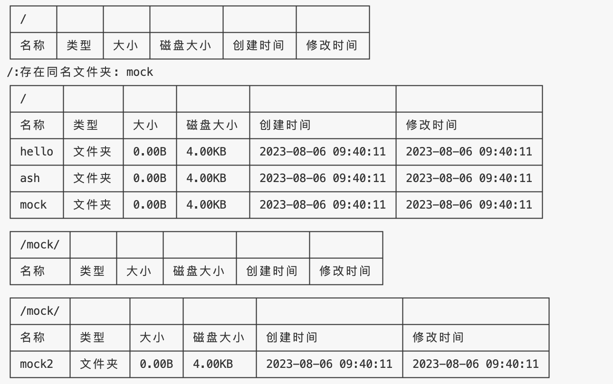

# SimpleFS
## 格式化
```rust
let fs = FS::mkfs("test.fs",1 * MB_BLOCK);
```
## 连接已有文件系统
```rust
let fs = FS::connect("test.fs");
```

## 创建文件夹
```rust
fs.mkdir("/hello", "ash");
```

## 写入文件
```rust
fs.write("/hello", "test.txt", "hello world".as_bytes());
```

## 读取文件
```rust
let content = fs.read("/hello/test.txt");
```

## Example
```rust
let fs = FS::mkfs("test.fs",1 * MB_BLOCK);
fs.ls("/");
fs.mkdir("/", "hello");
fs.mkdir("/", "ash");
fs.mkdir("/", "mock");
fs.mkdir("/", "mock");
fs.ls("/");
fs.ls("/mock");
fs.mkdir("/mock", "mock2");
fs.ls("/mock");
```


## Benchmark
```
写入测试/1KB       time:   [2.9667 ms 2.9911 ms 3.0174 ms]
                   		thrpt:  [331.41 KiB/s 334.33 KiB/s 337.08 KiB/s]
写入测试/4KB       time:   [3.0413 ms 3.0756 ms 3.1171 ms]
                   		thrpt:  [1.2532 MiB/s 1.2701 MiB/s 1.2844 MiB/s]
写入测试/16KB      time:   [3.0976 ms 3.1422 ms 3.2014 ms]
      	                thrpt:  [4.8806 MiB/s 4.9726 MiB/s 5.0442 MiB/s]
写入测试/64KB      time:   [3.9572 ms 4.1670 ms 4.3886 ms]
                        thrpt:  [14.241 MiB/s 14.999 MiB/s 15.794 MiB/s]
写入测试/256KB     time:   [4.7672 ms 4.8512 ms 4.9280 ms]
                        thrpt:  [50.730 MiB/s 51.534 MiB/s 52.442 MiB/s]
写入测试/1MB    time:   [5.1500 ms 5.2339 ms 5.3131 ms]
                        thrpt:  [188.21 MiB/s 191.06 MiB/s 194.18 MiB/s]	
写入测试/4MB    time:   [5.5781 ms 5.6292 ms 5.6892 ms]
                        thrpt:  [703.08 MiB/s 710.58 MiB/s 717.09 MiB/s]	
写入测试/16MB   time:   [13.271 ms 13.462 ms 13.703 ms]
                        thrpt:  [1.1402 GiB/s 1.1607 GiB/s 1.1774 GiB/s]				
写入测试/64MB   time:   [41.963 ms 42.136 ms 42.335 ms]
                        thrpt:  [1.4763 GiB/s 1.4833 GiB/s 1.4894 GiB/s]
写入测试/256MB  time:   [158.05 ms 160.81 ms 165.89 ms]
                        thrpt:  [1.5070 GiB/s 1.5547 GiB/s 1.5818 GiB/s]
```
小于 4 MB的小文件总体写入速度在 6 ms 以内  
大于 4 MB的大文件速度逐渐趋近于磁盘读写速度

## 文件系统组织形式
1. 前 8 字节为文件系统块数量(单个块大小为 4KB)  
2. 随后为 块数量 / 8 字节的bitset，用于标记块是否被使用  
3. 后续为文件系统的所有块，每 4KB 为一个块  


块 0 规定存储 根目录 / 的 block_ids，每8个字节为一个 u64 id  
初始化时默认创建 / 文件夹，存储在块 1  
文件夹也是文件，内部存储子文件的元数据(FSMeta)列表  
通过元数据FSMeta 中的 is_dir 字段判断是否为文件夹
