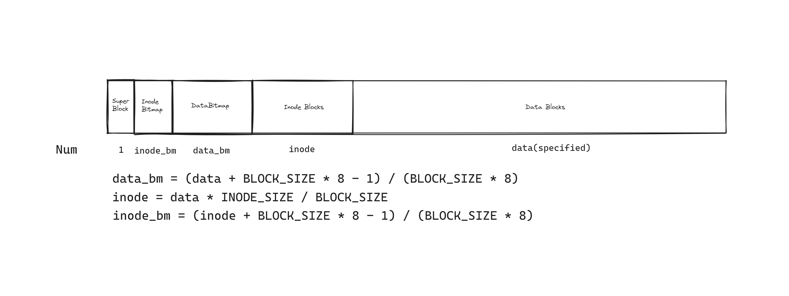

<h1 align="center"> SimpleFS </h1>
<p align="center"> Simple Toy FileSystem </p>

## 特性

- [x] 多级索引，可退化为直接索引，理论最高支持 256 级索引，64 ZB文件最多使用 8 级索引
- [x] 区间索引
- [x] 单文件大小上限(寻址上限) $2\space^{64} * 4\space KB = 64 \space ZB$
- [x] LRU 文件块缓存

## 文件结构



### Inode

```rust
// 存储在 Inode Blocks 区
pub struct Inode {
    // 1 索引等级,最小为 1,直接指向数据块,当前等级的索引无法满足上限后将索引升一级,最高 255 级
    pub index_level: u8,
    pub extra: [u8; 9],
    pub mode: u16,
    pub link_count: u32,
    pub created: u64,
    pub modified: u64,
    pub size: u64,
    pub uid: u32,
    pub gid: u32,
    pub index_node: IndexNode, // top-level 索引区间
}

// 存储在 Data Blocks
pub struct IndexNode {
    start_blk: usize,
    // inclusive
    len: usize,       // exclusive start_blk + len
}
```